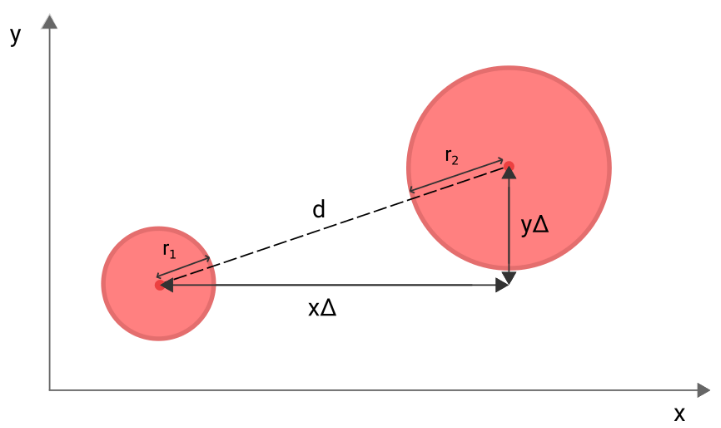

# Coding Challenge: Colisão Elástica

Este projeto visa simular um sistema de colisão elástica entre bolinhas 2D e entender a física e a matemática relacionada para conseguir resolver os problemas ao longo do processo de implementação. Para o desenvolvimento desse projeto foram usadas as seguintes tecnologias:

- C++
- CMake
- SFML

### O que é Colisão elástica?

Colisão elástica é um tipo de colisão onde os corpos não perdem energia cinética e não perdem momentum. Seus valores tanto antes da colisão quanto depois dela não sofrem alteração.

### Disclaimer e Arquivo Utilitário 

Além do código principal, onde está o coração da nossa aplicação, teremos um arquivo a mais chamado utility. Esse arquivo é responsável por guardar algumas funções úteis para nós mas que não necessariamente são imprescindíveis entrarem na explicação do processo de desenvolvimento. 
São funções, como gerar número aleatório considerando um valor mínimo e máximo e carregamento de fonte, além de uma classe para que possamos acompanhar o FPS em Tela. Não  irei passar por esse arquivo.

# Particle

A classe de partícula é responsável por guardar informações relevantes como massa, vetor de velocidade e configurações do shape 2D e encapsular seus dados oferecendo gets e sets. Uma função que é interessante aqui é a de mover.

```c
sf::CircleShape move(float deltaTime)
    {
        // S = S₀ + v ⋅ t
        float x = this->shape.getPosition().x + this->velocity.x * deltaTime;

        float y = this->shape.getPosition().y + this->velocity.y * deltaTime;
    
    [...]
 
```

Nesse projetos utilizaremos a fórmula do MRU - Movimento Retilíneo Uniforme:

- S = S₀ + v Δt

Ou seja, a nova posição é igual a posição atual da partícula mais a velocidade vezes `deltatime` - que é inclusive passado como parâmetro pois ele é capturado a cada laço do looping da main.

Assim que sabemos a nova posição de cada eixo, devemos validar se esse novo ponto no espaço encosta ou não nas bordas da tela. Caso sim, invertemos a velocidade daquele eixo para a partícula voltar.

```c
    if (x + this->radius() >= WINDOW_WIDTH || x - this->radius() <= 0)
    {
        this->velocity.x *= -1;
    }

    if (y + this->radius() >= WINDOW_HEIGHT || y - this->radius() <= 0)
    {
        this->velocity.y *= -1;
    }

    this->shape.setPosition({x, y});
    return this->shape;
```

# Simulation Class
Essa classe é responsável por lidar com a lógica de criação de partículas, colisão, lidar com o impacto e atualização e criação dos frames. 

A função update é responsável por atualizar a posição das partículas no mundo, as desenhando e verificando se elas colidiram com algo ou não. Nesse primeiro momento, a verificação das colisões está ocorrendo em o(n)², o que não é o ideal, mas para um sistema enxuto de poucas partículas, não nos dará problemas. O foco nesse primeiro momento é entender os conceitos, fórmulas e problemas.

```c
void update(float deltaTime)
    {
        for (int i = 0; i < this->particles.size(); i++)
        {
            this->window.draw(this->particles[i].spawn(deltaTime));

            for (int j = i + 1; j < this->particles.size(); j++)
            {
                this->particles[i].handleCollision(&this->particles[j]);
            }
        }
    }
```

# Colision Detection

A verificação das colisões dentro da classe `simulation` se dá recebendo duas partículas, A e B a partir do seguinte cenário:

- O segmento de reta resultante do ponto central da particula A e do ponto central da particula B deve ser igual ou menor do que a soma de seus raios.

Caso essa afirmação seja verdadeira, ocorreu uma colisão. Nesse momento, é chamado uma função que lida com o impacto, já que houve colisão.

A questão do momento é: 

> Como podemos capturar essa distância entre dois pontos?

A resposta é simples: pitágoras. 



Subtraímos o local de um círculo pelo outro para capturarmos X,Y e assim fica fácil achar a hipotenusa.

```c
    void handleCollision(Particle *particleA, Particle *particleB)
    {
        float xDistance = abs(particleA->getCenterPoint().x - particleB->getCenterPoint().x);
        float yDistance = abs(particleA->getCenterPoint().y - particleB->getCenterPoint().y);

        // a² + b² = c²
        float h = (xDistance * xDistance) + (yDistance * yDistance);
        float distance = sqrt(h);

        float sumOfRadius = particleA->radius() + particleB->radius();

        if (distance <= sumOfRadius)
        {
            this->handleImpact(particleA, particleB, distance);
        }
    }
```

# Collision Resolution

Após sabermos que as partículas colidiram, precisamos calcular sua nova direção. A direção é o resultado do conjunto das velocidades dos seus eixos. 

### Overlaping

No momento da colisão, é importante checarmos se as partículas estão sofrendo `overlaping` O que acontece é que pode ser que devido à alta velocidade, o deslocamento de posição entre um frame e outro faça com que as partículas fiquem em posições de modo a se sobrepor.


Devemos corrigir essa posição antes de fazermos os cálculos para não gerar bugs de colisão contínua - as partículas ficam "grudadas" colidindo infinitamente. 

> A reta resultante da distância entre os pontos centrais é chamado de **linha de impacto.**

Para saber se as partículas estão sofrendo com o `overlaping`, podemos verificar se a soma dos raios é maior do que a distância entre os pontos centrais das partículas.

Caso estejam, precisamos pegar o tamanho desse overlap e afastar as partículas de modo que elas fiquem distantes o suficiente para encostarem, mas não se sobreporem.

> - Partícula A -> raio 10
> - Partícula B -> raio 5
> - raio P.A 10 + raio P.B 5 = 15
> - Distância entre os pontos centrais 12
> - 12 é menor que 15 então elas estão se sobrepondo.
> - 15 - 12 = 3 de overlap.
> - Precisamos afastar cada partícula em 1.5 de distância.

```c
float idealDistance = particleA->radius() + particleB->radius();

if (distance < idealDistance)
{
    std::cout << "Overlaping!" << "\n";
    float overlap = (idealDistance - distance) / 2;
    sf::Vector2f direction;
    if (distance != 0.f)
    {
        direction = (particleB->getCenterPoint() - particleA->getCenterPoint()) / distance;
    }
    else
    {
        direction = sf::Vector2f(1.f, 0.f);
    }

    sf::Vector2f normalizedDirection = direction;
    particleA->setPosition(particleA->getCenterPoint() - normalizedDirection * overlap);
    particleB->setPosition(particleB->getCenterPoint() + normalizedDirection * overlap);
}
```